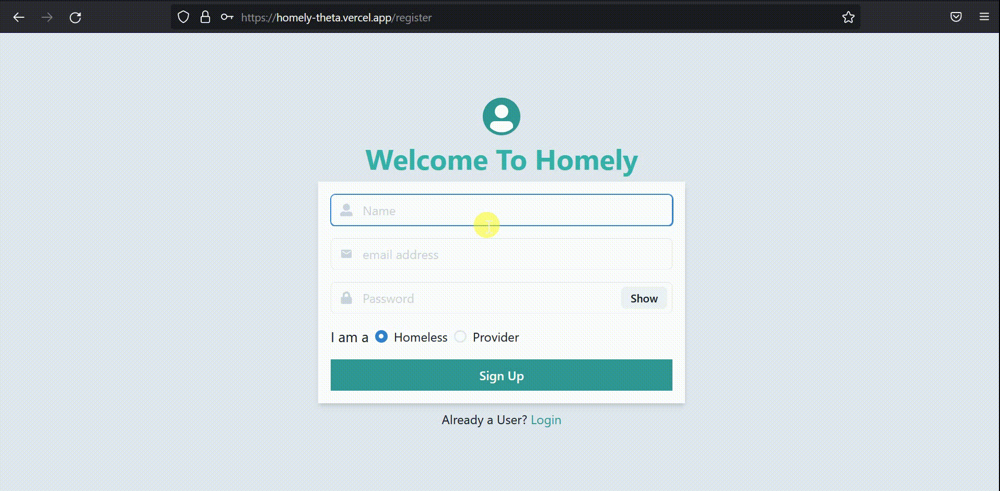
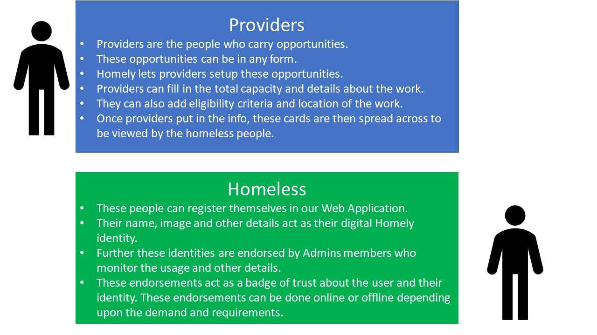

## Inspiration

There are so many homeless people out there in the world. We as passionate techies wanted to use technology to increase awareness and opportunities for these people to make the best of their life in an efficient way.

With our research and analysis, we realized that there are enough jobs for such people. The big gap is the right way to be the bridge between the homeless people and the opportunities and connect them with technology.

## What it does

Homely is a PWA (Progressive Web App) that acts as your digital identity and helps you find the opportunities available out there. We have three types of users:

### Providers

- Providers are the people who carry opportunities.
- These opportunities can be in any form.
- Homely lets providers setup these opportunities.
- Providers can fill in the total capacity and details about the work.
- They can also add eligibility criteria and location of the work.
- Once providers put in the info, these cards are then spread across to be viewed by the homeless people.

### Homeless Users

- These people can register themselves in our Web Application.
- Their name, image and other details act as their digital Homely identity.
- Further these identities are endorsed by Admins members who monitor the usage and other details.
- These endorsements act as a badge of trust about the user and their identity. These endorsements can be done online or offline depending upon the demand and requirements.

## How we built it

We built it with:

- NEXT JS
- Chakra UI
- Firebase
- Bootstrap
- Lots of Love

## Challenges we ran into

- Timezone differences
- Authentication setup and DevOps

## Accomplishments that we're proud of

- Built an End to End Web Application
- Learnt about best coding practices
- Collaborating with a team across different timezones

## What we learned

- JWT Authentication
- Chakra UI
- Building Progressive Web Apps
- NEXT JS

## What's next for Homely

- Add Accuracy and Reliability based on User Identity
- Improve upon UX of the App
- Add more features and functionalities to the App
